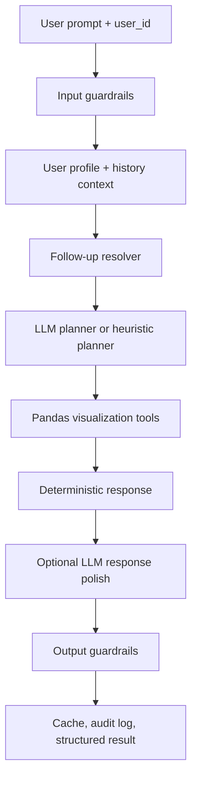

# LedgerGuard RAG

Privacy-preserving tabular RAG for personal finance transactions. LedgerGuard RAG answers spending, income, savings, category, and trend questions from a user-scoped Pandas DataFrame, generates grounded visualizations, and protects against cross-user leakage, prompt injection, ungrounded outputs, LLM outages, timeouts, and token-budget pressure.

Recommended repository name: `ledgerguard-rag`

Current Python package/project name: `vola-finance-assignment`

## What This Project Does

LedgerGuard RAG is a DataFrame-first financial assistant. It uses an LLM for planning and response polish when available, but all financial numbers come from deterministic Pandas computations over the authenticated user's own transaction rows.

The app can answer questions such as:

- "What did I spend the most on last month?"
- "Show me my spending trend."
- "Am I saving money?"
- "Can you go further back?"
- "What about the last 6 months?"

It is designed around four production concerns:

- User isolation: every computation is filtered by the selected/authenticated `user_id`.
- Grounding: responses are validated against computed tool summaries.
- Resilience: LLM failures fall back to deterministic Pandas answers.
- Auditability: cache, history, guardrail flags, visualizations, and traces are captured without exposing raw names to the LLM.

## Architecture



The workflow is implemented in `transaction_rag/workflow.py` with LlamaIndex Workflow events:

- `validate_input`
- `assemble_context`
- `resolve_follow_up`
- `plan_response`
- `dispatch_tools`
- `compose_response`
- `finalize`

## Repository Layout

```text
.
|-- app.py                         # Gradio UI
|-- data/                          # Assessment transaction CSV
|-- evals/                         # JSONL edge-case evaluation datasets
|-- tests/                         # Pytest coverage for pipeline, guardrails, evals
|-- transaction_rag/
|   |-- cache.py                   # SQLite cache, chat history, audit table
|   |-- config.py                  # Settings and environment variables
|   |-- context.py                 # Prompt context, sanitization, token-budget compaction
|   |-- data.py                    # DataFrame repository and user-scoped filtering
|   |-- guardrails.py              # Input and output guardrails
|   |-- llm.py                     # OpenRouter client, retries, circuit breaker, heuristics
|   |-- models.py                  # Pydantic models and guardrail enums
|   |-- observability.py           # Phoenix/OpenTelemetry tracing
|   |-- pipeline.py                # Public sync/async pipeline wrapper
|   |-- privacy.py                 # PII and user-id redaction helpers
|   |-- responses.py               # Deterministic grounded response builder
|   |-- tools.py                   # Pandas summaries and chart generation
|   `-- workflow.py                # Agentic workflow graph
|-- docker-compose.yml             # Phoenix tracing service
|-- pyproject.toml                 # Python dependencies
`-- uv.lock                        # Locked dependency graph
```

Generated runtime files are intentionally ignored:

- `.env`
- `.venv/`
- `cache.sqlite3`
- `audit/*.jsonl`
- `outputs/*.png`
- pytest and Python cache folders

## Features And Implementation Details

### 1. DataFrame-first transaction analysis

The project does not let the LLM calculate financial totals from raw free text. Financial calculations are done in `transaction_rag/data.py` and `transaction_rag/tools.py`.

The repository requires these columns:

- `user_id`
- `user_name`
- `transaction_date`
- `transaction_amount`
- `transaction_category_detail`
- `merchant_name`

`TransactionDataRepository` normalizes transaction dates, casts amounts to floats, sorts rows, and exposes scoped helpers such as:

- `get_user_df(user_id)`
- `compute_user_profile(user_id)`
- `filter_user_transactions(user_id, period=..., months=..., category_filter=...)`
- `summarize_frame(df)`

The sign convention is:

- Positive `transaction_amount`: expense
- Negative `transaction_amount`: income

### 2. User ID mapping and user isolation

User IDs are not generated or hardcoded by the app. They come from the transaction dataset.

At startup, `TransactionDataRepository` dynamically derives the available user map from the DataFrame:

```python
self._user_names = (
    self.df.groupby("user_id")["user_name"].first().astype(str).to_dict()
)
```

Every query validates the selected `user_id` and filters rows using:

```python
self.df.loc[self.df["user_id"] == user_id].copy()
```

The Gradio dropdown in `app.py` is populated from `pipeline.repository.user_ids`, which is derived from the loaded data. In a production deployment, the UI dropdown should be replaced by the authenticated session's internal user ID, and the pipeline should receive either that ID or an already-shortlisted per-user DataFrame.

### 3. Privacy-preserving context construction

`transaction_rag/context.py` builds planner and response prompts without sending raw user names to the LLM.

Privacy controls include:

- `privacy.redact_pii()` replaces known user IDs and names with placeholders.
- `_strip_sensitive_keys()` removes `user_id`, `user_name`, local file paths, and visualization paths from LLM context.
- `_response_profile_metadata()` only allows coverage metadata such as date range, transaction count, category count, and latest month.
- Query history is stored in sanitized form.

The structured result intentionally keeps `user_name=None` so raw names are not surfaced back to the UI or downstream consumers.

### 4. Input guardrails

`transaction_rag/guardrails.py` implements deterministic input checks before any LLM planning:

- Prompt injection detection, such as requests to reveal or override system instructions.
- Cross-user leakage detection by mentioned `usr_*` IDs, generic `user_*` IDs, full names, and unique first/last-name parts belonging to other users.
- Off-topic detection for prompts outside financial transaction analysis.
- Prompt length truncation through `max_prompt_chars`.

Blocked prompts return a safe response and do not dispatch tools.

### 5. Follow-up resolver

Follow-up intelligence is implemented as a dedicated workflow step, `resolve_follow_up`, before LLM planning.

The resolver uses the cached `VizState` from the same user to understand short follow-ups like:

- "Can you go further back?"
- "Can you go more 6 months in the history?"
- "What about the last 6 months?"
- "What about last month?"

It preserves the previous analysis type unless the user explicitly asks for a new metric. For example:

- After "Am I saving money?", "go further back" keeps `plot_income_vs_expense`.
- After "Show me my spending trend", "go further back" keeps `plot_monthly_spending_trend`.
- After "What did I spend the most on last month?", "last 6 months" keeps `plot_category_breakdown`.
- If the follow-up explicitly changes the metric, the normal planner handles the switch.

The resolver also clamps date windows to the user's available transaction history and adds a coverage note when the user asks for more history than exists.

### 6. Visualization tools

The app exposes three deterministic tools in `transaction_rag/tools.py`.

`plot_category_breakdown`

- Builds a donut chart for top spending categories.
- Supports period windows such as `last_month`, `last_3_months`, `last_6_months`, and `all`.
- Returns total spend, top category, category shares, rows used, and the chart path.

`plot_monthly_spending_trend`

- Builds a monthly spend line chart with a rolling-average overlay.
- Supports `months`, optional `period`, and optional `category_filter`.
- Returns monthly totals, latest month spend, average monthly spend, and delta from the first month.

`plot_income_vs_expense`

- Builds grouped income/expense bars with an optional net savings line.
- Supports `months`, optional `period`, and `show_net_line`.
- Returns monthly income, expense, net savings, total income, total expense, and total net savings.

Chart filenames include the scoped `user_id` and a hash of non-user parameters so repeated runs are stable without exposing names.

### 7. LLM planning with deterministic fallback

`transaction_rag/llm.py` uses OpenRouter through the OpenAI-compatible client when `ENABLE_LLM=true` and `OPENROUTER_API_KEY` is configured.

The LLM has two roles:

- Planner: returns strict JSON matching `PlannerOutput`.
- Response composer: optionally rewrites the deterministic answer into a concise user-facing response.

If the LLM is unavailable, malformed, times out, or the circuit is open, the system falls back to `LLMClient.heuristic_plan()` and deterministic response generation. This means the app remains useful without an LLM key.

### 8. Timeouts and circuit breaker behavior

Production resilience is handled in `transaction_rag/llm.py` and `transaction_rag/workflow.py`.

Configured controls:

- `request_timeout_seconds`: timeout for OpenRouter calls.
- `circuit_breaker_threshold`: number of failures before the circuit opens.
- Tenacity retries for retryable LLM errors.
- Separate exception types for timeout, circuit-open, malformed output, and LLM-unavailable paths.

Workflow behavior:

- Planner timeout -> use heuristic planner and add `timeout`.
- Planner circuit open -> use heuristic planner and add `circuit_open`.
- Response timeout/circuit open -> keep deterministic answer and add the operational flag.
- Malformed planner JSON -> use heuristic planner and add `malformed_llm_output`.
- LLM disabled or missing key -> use deterministic fallback and add `llm_unavailable`.

Operational flags remain in structured output and audit logs. `app.py` only displays user-facing safety flags in the chat UI.

### 9. Token budget management

`ContextManager.maybe_summarize_history()` estimates prompt size before planning. If planner context plus expected output would exceed `token_budget`, it summarizes older middle history and retains:

- The first history item
- The two newest history items
- A compact chat summary

The result is flagged with `token_budget_exceeded`, and tests verify that history compaction works under intentionally tiny budgets.

### 10. Output guardrails and grounding

`OutputGuardrails.validate()` checks generated answers after tool execution.

It flags:

- Toxic or inappropriate generated text
- Low confidence when no data is available
- Numeric claims not grounded in the computed tool summaries

`responses.collect_allowed_numbers()` walks the computed tool summaries and profile metadata to build the allowed numeric set. If an LLM response introduces unsupported numbers, `workflow.finalize()` attempts to replace it with the deterministic response.

### 11. Cache, history, and audit trail

`transaction_rag/cache.py` stores:

- Per-user profile cache
- Per-user query history
- Per-user visualization state
- Per-user chat summary
- Audit events

The cache uses SQLite through SQLAlchemy. Audit records are written both to JSONL and to the SQLite audit table. Audit payloads include prompt/response summaries, latency, guardrail flags, visualization counts, tool names, and token usage.

### 12. Observability

`transaction_rag/observability.py` integrates with Phoenix/OpenTelemetry when the collector is reachable.

The workflow creates spans for:

- Input validation
- Context assembly
- Follow-up resolution
- Planning
- Tool dispatch
- Final response
- Guardrail/cache/audit finalization

Tracing is optional and fails closed. If Phoenix is not running, the app continues normally.

### 13. Gradio UI

`app.py` exposes a local Gradio app with:

- User ID selector
- Chat interface
- Visualization gallery
- Structured JSON output panel

The chat response includes generated visualization paths and visible guardrail flags. Operational flags are preserved in the structured output but hidden from the chat response to avoid confusing users with internal fallback states such as `llm_unavailable`.

### 14. Edge-case evaluation coverage

The test suite covers the core product risks:

- Category, trend, and savings questions
- Last-month and multi-month windows
- Follow-up history expansion
- Explicit metric switching
- Prompt injection blocking
- Cross-user leakage blocking by ID, full name, first name, and last name
- Off-topic blocking
- Input truncation
- Output grounding
- LLM timeout fallback
- Circuit breaker fallback
- Token budget compaction
- PDF assessment scenarios
- Custom JSONL edge-case datasets

The JSONL evaluation files live in `evals/`, and `tests/test_edge_case_eval_dataset.py` runs them as parameterized tests.

## Setup

This project uses `uv`.

```bash
uv sync
```

Create a local `.env` file if you want LLM calls:

```bash
OPENROUTER_API_KEY=your_openrouter_key
ENABLE_LLM=true
```

The app also works without an LLM:

```bash
ENABLE_LLM=false
```

## Run The App

Start Phoenix tracing, optional but useful:

```bash
docker compose up -d
```

Start Gradio:

```bash
uv run python app.py
```

Default URLs:

- Gradio app: `http://127.0.0.1:7860`
- Phoenix: `http://localhost:16006`

## Python API Usage

```python
import pandas as pd

from transaction_rag import TransactionRAGPipeline

df = pd.read_csv("data/assessment_transaction_data.xlsx - Transactions.csv")
pipeline = TransactionRAGPipeline(df=df)

result = pipeline.run(
    user_id="usr_a1b2c3d4",
    prompt="What did I spend the most on last month?",
)

print(result.model_dump(mode="json"))
```

## Configuration

Settings are defined in `transaction_rag/config.py` and can be set through environment variables.

| Setting | Default | Purpose |
| --- | --- | --- |
| `OPENROUTER_API_KEY` | unset | Enables OpenRouter LLM calls |
| `ENABLE_LLM` | `true` | Turns LLM planner/composer on or off |
| `OPENROUTER_PLANNER_MODELS` | configured free-model list | Planner model fallback order |
| `OPENROUTER_RESPONSE_MODELS` | configured free-model list | Response model fallback order |
| `llm_max_output_tokens` | `900` | Maximum LLM output tokens |
| `request_timeout_seconds` | `12.0` | OpenRouter request timeout |
| `circuit_breaker_threshold` | `3` | Failure count before circuit opens |
| `max_prompt_chars` | `1200` | Input prompt truncation limit |
| `token_budget` | `8000` | Planner context token budget |
| `max_history_items` | `6` | Per-user query history retention |
| `sqlite_path` | `cache.sqlite3` | SQLite cache path |
| `outputs_dir` | `outputs` | Visualization output directory |
| `audit_log_path` | `audit/audit.jsonl` | JSONL audit log path |
| `tracing_enabled` | `true` | Enables Phoenix tracing if reachable |
| `gradio_host` | `127.0.0.1` | Gradio bind host |
| `gradio_port` | `7860` | Gradio bind port |

## Run Tests

```bash
uv run pytest
```

The tests run with `enable_llm=False` unless they are explicitly exercising fake timeout/circuit behavior, so they are deterministic and do not require OpenRouter access.

## Data Assumptions

The included assessment CSV is used as the local demo dataset. The app assumes:

- A stable `user_id` exists before the pipeline is called.
- The app or auth layer selects the active user.
- The transaction DataFrame includes only allowed source columns.
- All computations are scoped to the current user.
- Raw names should not be exposed to the LLM or response layer.

For production, replace the sample CSV with an authenticated per-user data access layer. The safest pattern is to pass an already-filtered DataFrame for the authenticated user or enforce server-side `user_id` filters before invoking the pipeline.

## Development Notes

- Use `rg` for code search.
- Keep financial calculations in deterministic Pandas code.
- Treat LLM output as untrusted text until output guardrails validate it.
- Add new edge cases to `evals/custom_edge_cases.jsonl`.
- Prefer adding tests for new guardrail, follow-up, or data-scope behavior.
- Do not commit `.env`, cache files, audit logs, generated charts, or local virtual environments.

## Suggested Project Name

The recommended project name is **LedgerGuard RAG**.

Why this name works:

- "Ledger" signals transaction and money analysis.
- "Guard" signals privacy, grounding, and leakage prevention.
- "RAG" signals the architecture without over-branding the product.

Suggested repository slug: `ledgerguard-rag`.
